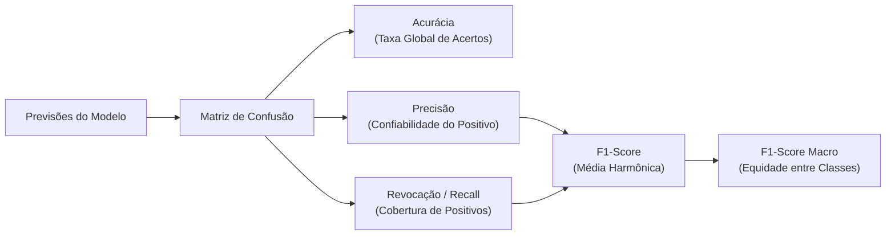

# 📊 Análise Aprofundada dos Resultados de Machine Learning

Este documento apresenta uma análise técnica e conceitual dos resultados obtidos na classificação dos modelos para os dois cenários do projeto: **Predição de Compra** ([Renda.py](file:///c:/TecnologiaAplicadaSaude/Renda.py)) e **Predição de Risco de Internação** ([Saude.py](file:///c:/TecnologiaAplicadaSaude/Saude.py)).

A análise tem como foco:
1. **Compreensão e explicação detalhada das métricas** (Acurácia, Precisão, Revocação e F1-Score Macro).
2. **Interpretação das Matrizes de Confusão** e avaliação da adequação dos conjuntos de dados.
3. **Diagnóstico empírico de Overfitting, Underfitting e capacidade de generalização** dos modelos.

---

## 1. Conceituação e Explicação das Métricas de Avaliação

Avaliar um classificador supervisionado requer compreender o que cada métrica mede e suas limitações operacionais.

### 1.1 Acurácia (Accuracy)
* **Definição:** Proporção de todas as classificações corretas (tanto positivas quanto negativas) em relação ao total de observações avaliadas.
* **Fórmula:**
  $$\text{Acurácia} = \frac{VP + VN}{VP + VN + FP + FN} = \frac{\text{Total de Acertos}}{\text{Total de Amostras}}$$
* **Interpretação:** É uma métrica intuitiva de taxa global de sucesso.
* **A Armadilha do Paradoxo da Acurácia:** Quando as classes são desbalanceadas, a acurácia pode ser artificialmente inflada. Se um dataset tiver 90% de casos negativos, um modelo ingênuo que preveja apenas "Não" terá 90% de acurácia, embora seja inútil na detecção da classe de interesse.

### 1.2 Precisão (Precision) e Revocação (Recall / Sensibilidade)
* **Precisão:** De todas as previsões em que o modelo disse "Sim", quantas estavam de fato corretas?
  $$\text{Precisão} = \frac{VP}{VP + FP}$$
  * *Relevância:* Evita alarmes falsos (falsos positivos).
* **Revocação (Recall):** De todos os casos reais positivos existentes no conjunto de dados, quantos o modelo conseguiu detectar?
  $$\text{Recall} = \frac{VP}{VP + FN}$$
  * *Relevância:* Evita deixar passar casos graves (falsos negativos), essencial na área médica (ex: não detectar um paciente em risco de internação).

### 1.3 F1-Score e F1-Score Macro
* **F1-Score:** É a **média harmônica** entre Precisão e Revocação:
  $$F_1 = 2 \times \frac{\text{Precisão} \times \text{Recall}}{\text{Precisão} + \text{Recall}} = \frac{2 \cdot VP}{2 \cdot VP + FP + FN}$$
  A média harmônica penaliza severamente valores extremos. Se um modelo tiver Recall = 100% mas Precisão = 10%, seu F1-Score desaba, expondo o desequilíbrio.
* **F1-Score Macro (Média Aritmética Não Ponderada):**
  Calcula o F1-Score independentemente para a Classe 0 e para a Classe 1, calculando em seguida a média simples:
  $$F_{1\text{ (Macro)}} = \frac{F_{1\text{ (Classe 0)}} + F_{1\text{ (Classe 1)}}}{2}$$
  * **Por que é a métrica mais confiável aqui?** O F1-Score Macro atribui o **mesmo peso** a ambas as classes, independentemente do número de ocorrências na base. Se um modelo negligenciar a classe minoritária para inflar a acurácia global, o F1-Score Macro cai drasticamente, denunciando o viés.

---

## 2. Análise da Matriz de Confusão e Adequação dos Dados

A matriz de confusão compara os rótulos reais com os previstos:

| | Previsto Negativo (0) | Previsto Positivo (1) |
| :--- | :---: | :---: |
| **Real Negativo (0)** | **Verdadeiro Negativo (VN)** | **Falso Positivo (FP)** |
| **Real Positivo (1)** | **Falso Negativo (FN)** | **Verdadeiro Positivo (VP)** |

---

### 2.1 Problema 1: Predição de Compra (`Renda.py`)

* **Amostragem total:** 250 instâncias (151 classe 0 [60,4%] e 99 classe 1 [39,6%]).
* **Conjunto de Teste (30% estratificado):** 75 instâncias (45 da classe 0 e 30 da classe 1).

#### Diagnóstico pelas Matrizes de Confusão:
1. **Falta de Sensibilidade na Classe Positiva:**
   * **Logistic Regression & Naive Bayes:** Ambos geraram matriz `[[37, 8], [18, 12]]`. De 30 compradores reais, o modelo errou 18 (FN = 18) e identificou apenas 12 (VP = 12). Recall da classe 1 = apenas **40%**.
   * **Gradient Boosting:** Matriz `[[37, 8], [22, 8]]`. Errou 22 de 30 compradores reais (FN = 22). O modelo tendeu a classificar quase tudo como não comprador (classe majoritária). Isso explica a queda de seu F1-Score Macro para **0.5297**, bem abaixo da sua acurácia de 0.6000.
   * **Random Forest & SVM:** Tiveram desempenho mais equilibrado. Random Forest acertou 39 VN e 13 VP (apenas 6 falsos positivos), mantendo o F1 Macro mais alto do ranking (0.6514).
2. **Adequação dos Dados:**
   * O desbalanceamento moderado (60% x 40%) aliado a um volume amostral relativamente pequeno (250 linhas) dificulta o aprendizado de fronteiras nítidas de decisão para a classe minoritária.
   * As variáveis preditivas (`Score_Credito`, `Pontuacao_Engajamento`, `Renda_Anual_K`, `Idade`) apresentam sobreposição entre os grupos, exigindo técnicas de balanceamento (como SMOTE) ou coleta de mais amostras para melhorar o recall.

---

### 2.2 Problema 2: Predição de Risco de Internação (`Saude.py`)

* **Amostragem total:** 250 instâncias (125 classe 0 [50,0%] e 125 classe 1 [50,0%]).
* **Conjunto de Teste (30% estratificado):** 75 instâncias (38 sem risco e 37 com risco).

#### Diagnóstico pelas Matrizes de Confusão:
1. **Excelente Simetria e Robustez Clínica:**
   * **Naive Bayes (Melhor Modelo):** Matriz `[[33, 5], [9, 28]]`.
     * Verdadeiros Negativos: 33 de 38 (Especificidade = 86,8%).
     * Verdadeiros Positivos: 28 de 37 (Sensibilidade = 75,7%).
     * Houve apenas 5 alarmes falsos (FP) e 9 casos em que o risco não foi antecipado (FN).
   * **Gradient Boosting:** Matriz `[[31, 7], [9, 28]]` (Acurácia: 0.7867, F1 Macro: 0.7863).
   * **Logistic Regression:** Matriz `[[28, 10], [8, 29]]` (Acurácia: 0.7600, F1 Macro: 0.7600).
2. **Adequação dos Dados:**
   * A distribuição **perfeitamente balanceada (50/50)** foi determinante: como consequência direta, **a Acurácia e o F1-Score Macro praticamente coincidiram** em todos os modelos (ex: Naive Bayes com 81,33% de acurácia e 81,25% de F1).
   * As variáveis fisiológicas (`Pressao_Arterial`, `Colesterol_Total`, `Frequencia_Cardiaca_Max` e `Idade`) demonstraram forte poder preditivo discriminante para indicar o risco de internação hospitalar.

---

## 3. Investigação de Overfitting vs. Underfitting

O **Overfitting (Sobreajuste)** ocorre quando o modelo aprende em demasia os detalhes específicos, o ruído e as peculiaridades do conjunto de treinamento, perdendo a capacidade de generalizar para dados inéditos (conjunto de teste).

Para diagnosticar com rigor a presença de overfitting, comparou-se a acurácia de cada modelo no **Conjunto de Treinamento** versus no **Conjunto de Teste**:

### 3.1 Comparativo Empírico Treino vs. Teste

#### Problema 1: Compra (`dados_predicao_modelos.csv`)
| Modelo | Acurácia Treino | Acurácia Teste | Diferença (Gap) | Diagnóstico |
| :--- | :---: | :---: | :---: | :--- |
| **Logistic Regression** | 70.86% | 65.33% | +5.53% | **Sem Overfitting** (Ótima generalização) |
| **Naive Bayes** | 72.00% | 65.33% | +6.67% | **Sem Overfitting** (Baixa variância) |
| **SVM** | 77.71% | 68.00% | +9.71% | **Leve / Controlado** |
| **KNN** | 77.71% | 65.33% | +12.38% | **Moderado** |
| **Decision Tree** | 100.00% | 65.33% | **+34.67%** | **Overfitting Severo** |
| **Random Forest** | 100.00% | 69.33% | **+30.67%** | **Overfitting Estrutural nas Árvores** |
| **Gradient Boosting** | 99.43% | 60.00% | **+39.43%** | **Overfitting Severo** |

#### Problema 2: Risco de Internação (`dados_saude_predicao.csv`)
| Modelo | Acurácia Treino | Acurácia Teste | Diferença (Gap) | Diagnóstico |
| :--- | :---: | :---: | :---: | :--- |
| **Logistic Regression** | 76.57% | 76.00% | **+0.57%** | **Excelente Generalização** |
| **Naive Bayes** | 76.57% | 81.33% | **-4.76%** | **Excelente Generalização** (Sem overfitting) |
| **SVM** | 81.71% | 74.67% | +7.04% | **Leve / Saudável** |
| **KNN** | 80.00% | 69.33% | +10.67% | **Moderado** |
| **Gradient Boosting** | 100.00% | 78.67% | **+21.33%** | **Overfitting Moderado/Alto** |
| **Decision Tree** | 100.00% | 76.00% | **+24.00%** | **Overfitting Alto** |
| **Random Forest** | 100.00% | 74.67% | **+25.33%** | **Overfitting Estrutural nas Árvores** |

---

### 3.2 Análise dos Padrões de Overfitting

1. **Árvores de Decisão sem Poda (`DecisionTreeClassifier`):**
   * Nos dois cenários, a árvore atingiu **100% de acurácia no treino**, mas caiu entre 24% e 35% no teste. Isso ocorre porque o algoritmo cria nós e folhas até isolar cada amostra individual do treino, decorando ruídos.
2. **Modelos Baseados em Boosting (`GradientBoostingClassifier`):**
   * O Gradient Boosting foi o mais prejudicado pelo overfitting no Problema 1 (gap de quase 40%). Ele ajustou estimadores iterativamente nos resíduos de um dataset pequeno (175 amostras de treino), memorizando o padrão do treino sem conseguir generalizar no teste.
3. **Random Forest:**
   * Embora suas árvores individuais tenham decorado o treino (100%), o mecanismo de agregação por votação (bagging) reduziu a variância e mitigou o impacto negativo, mantendo-a em 1º lugar no Problema 1.
4. **Modelos Probabilísticos e Lineares (Naive Bayes e Regressão Logística):**
   * Demonstraram a maior consistência entre treino e teste (diferença inferior a 6% em ambos os casos). No Problema 2, o Naive Bayes superou inclusive os ensembles complexos, pois as suposições gaussianas de distribuição contínua dos dados clínicos funcionaram de maneira muito eficaz.

---

## 4. Conclusões e Recomendações Técnicas

| Aspecto | Problema 1 (Compra) | Problema 2 (Saúde) |
| :--- | :--- | :--- |
| **Qualidade da Base** | Desbalanceada (60/40), exigindo maior atenção à classe positiva | Balanceada (50/50), ótima distribuição |
| **Melhor Modelo** | **Random Forest** (F1: 0.6514, Acc: 0.6933) | **Naive Bayes** (F1: 0.8125, Acc: 0.8133) |
| **Risco de Overfitting** | Elevado nos modelos de árvores/boosting (gaps > 30%) | Moderado a baixo; modelos lineares e bayesianos muito estáveis |
| **Métrica Mais Indicada** | **F1-Score Macro** (evita ilusão gerada pela classe majoritária) | **Acurácia e F1-Score** (ambas refletem a realidade com precisão) |

### Recomendações para Melhorias Futuras:
1. **Regularização de Hiperparâmetros:** Limitar `max_depth` (ex: 3 a 5), ajustar `min_samples_split` e `min_samples_leaf` para impedir árvores de atingirem 100% de treino artificial.
2. **Balanceamento de Dados:** Aplicar técnicas como SMOTE ou ajuste de pesos de classe (`class_weight='balanced'`) no script [Renda.py](file:///c:/TecnologiaAplicadaSaude/Renda.py) para reduzir os falsos negativos.
3. **Validação Cruzada (K-Fold Stratified):** Substituir a divisão única 70/30 por uma validação cruzada de 5 ou 10 folds, garantindo estimativas de variância ainda mais robustas.
